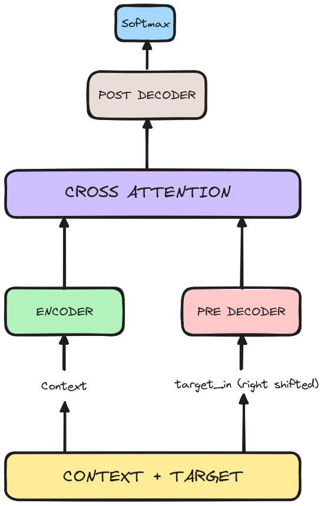

# Neural Machine Translation Pytorch

Small project to implement an NMT system from scratch to understand the intuition behind complex systems. I utilized a biLSTM and a cross-attention mechanism. For training, I employed the teacher forcing method. The database used is english to portugues located under `data/por-end/por.txt`.

## Results

Bellow are the scores:

| Metrics | Scores |
| --- | ----------- |
| blue1 | 0.9639 |
| rouge1_fmeasure | 0.6756 |
| rouge1_precision | 0.6761 |
| rouge1_recall | 0.6898 |
| rouge2_fmeasure | 0.4788 |
| rouge2_precision |0.4798 |
| rouge2_recall | 0.4901 |
| rougeL_fmeasure | 0.6676 |
| rougeL_precision | 0.6682 |
| rougeL_recall | 0.6816 |
| rougeLsum_fmeasure |0.6677 |
| rougeLsum_precision | 0.6682 |
| rougeLsum_recall | 0.6817 |

Here is a result table of a couple sentences. 

| English | Portugues |
| --- | ----------- |
| She reads a book. | ela le um livro . |
| We enjoy the sunrise. | nos gostamos do sol nascer . |
| The cat sleeps on the sofa. | o gato dorme no sofa . |
| He cooks dinner. | ele ensina o jantar . |
| Birds fly south in the winter. | pássaros Kyoto no inverno . |